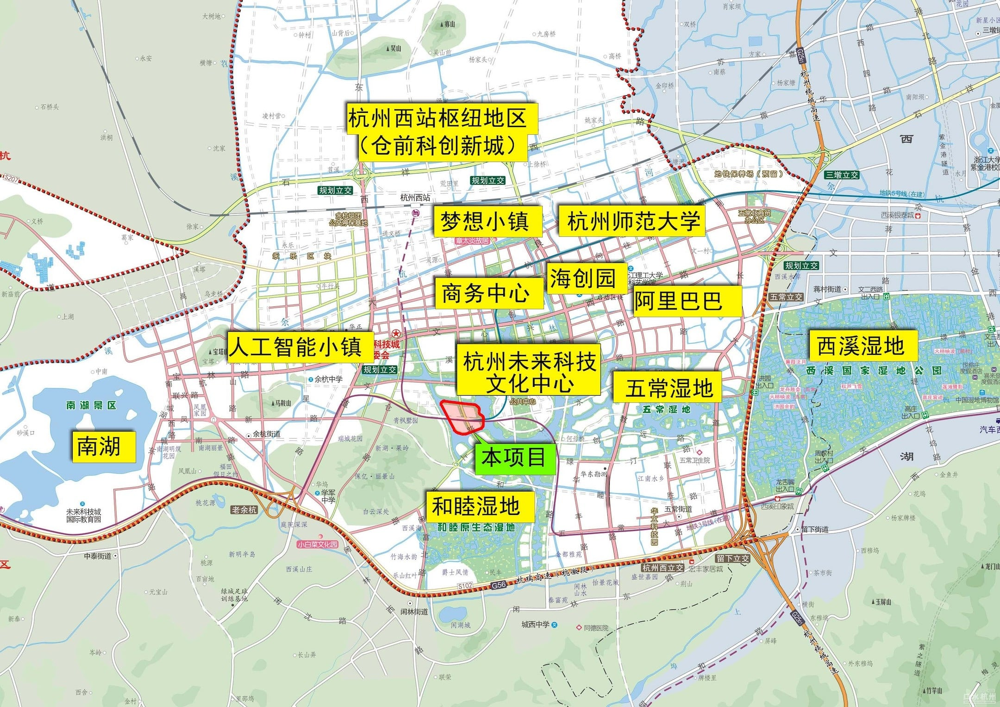
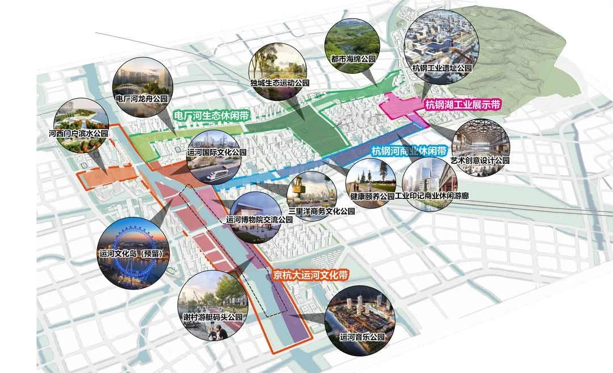
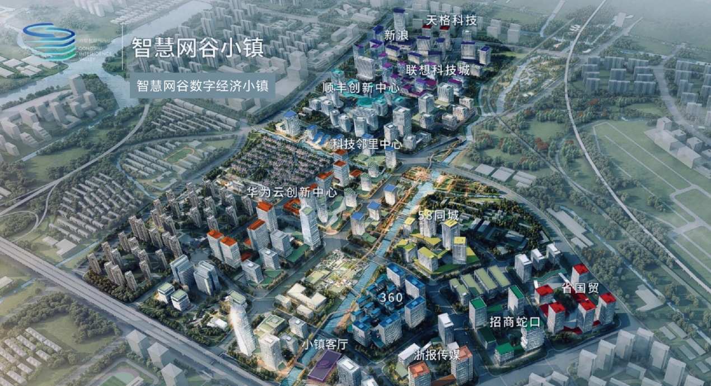
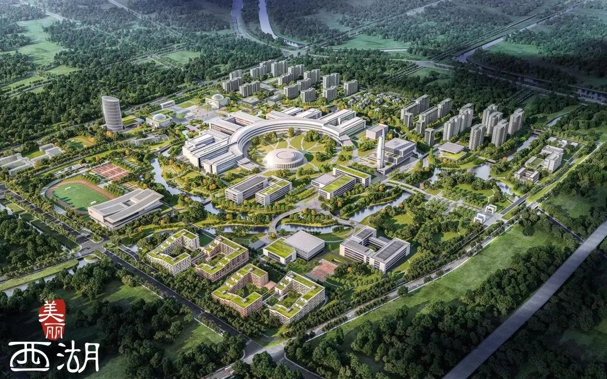

<Adsense :data-ad-client=$themeConfig.ads.client :data-ad-slot=$themeConfig.ads.slot is-new-ads-code="yes" class="side-ads"></Adsense>

# 板块

这个单元将着重对杭州购房几个热门板块进行介绍，并主观上分析它们的优势和劣势。

## 未来科技城

:::tip
新房限价：高层37,000元/平  
二手房价格：5~7万元/平  
适合人群：有无房资格，或者预算充足的二手房购房者  
:::

如果给杭州热门板块进行排名，未来科技城绝对可以排在前二甚至第一。

该板块位于杭州市余杭区，是由中组部、国资办确定的全国四个未来科技城之一（另三个分别在北京、天津、武汉），并被浙江省定位为高端人才集聚区、自主创新示范区和科学发展新城区。

阿里巴巴全球总部坐落于此，还包含海创园、欧美金融城、梦想小镇等高新技术集群，大量独角兽公司已经入驻，OPPO 和 VIVO 也确定在此设立总部。

总规划面积113平方公里，其中海创园一期附近35平方公里被定为重点建设区，向西至南湖还有未来科技城2.0规划，目前已落成菜鸟集团总部、阿里达摩院、人工智能小镇。

核心板块的中心是杭州市政府规划的公共中心，整个公共中心分成了六小块，分别设立市民中心、全民体育中心、科技文化中心、国际演艺中心、会议中心、会展中心，再加上华润竞拍到绿汀路TOD地块（下图绿色标识），很有可能规划一座万象城，一站式满足市民的生活需求，也补齐了板块“没有生活气息”的短板。

正是如此强大的规划背景下，导致该板块的二手房价格突飞猛进，目前的价格已经大幅预支了板块的潜力，核心区域成交价格已经6万起步。与新房不足4万的限价形成大幅倒挂，导致该板块所有新楼盘都是“社保巨子”拼抢密集区，并且供应量紧缺，因此如果没有无房资格又不想买高价二手房，就不用关注这个板块了。

## 钱江世纪城

:::tip
新房限价：高层47,000元/平  
二手房价格：7~10万元/平  
适合人群：有无房资格，或者预算充足的二手房购房者  
:::

可以和未来科技城进行对抗的板块，只有钱江世纪城。

该板块位于萧山区，钱塘江南岸，与繁华的钱江新城隔岸相望，是浙江省政府、杭州市政府、萧山区政府共同倾力建设的新金融中心、科创中心、城市新中心、中央商务区（CBD）、中央活动区（CAZ）。

这里是2016年G20峰会的举办地，2022年亚运会也将在这里的奥体中心举办。而作为CBD级别的规划，也吸引了诸如浙商产融、国信证券、中建投资、网易、商汤科技等大量金融与科技巨头入驻。生活方面，奥体印象城已经建成，近期高端商场项目 SKP 也落户于此，加上奥体中心的体育场馆在亚运会后也会转为民用。

虽然板块面积只有22平方公里，但是由于紧邻西靠滨江区，北望钱江新城，东临萧山科技城，南接萧山核心，并且仅凭现有配套就已经是高配置成熟板块。因此二手房也是突破天际的价位，并且豪宅遍地。这也让新盘限价呈现巨额的倒挂，买到就是几百万的收益，所以基本满社保月数才有资格入围摇号。

不过周围板块如市北、宁围这些板块无论价格和中签率都更平民一些，感兴趣可以考虑。

<InArticleAdsense :data-ad-client=$themeConfig.ads.client :data-ad-slot=$themeConfig.ads.inSlot is-new-ads-code="yes"></InArticleAdsense>

## 运河新城

:::tip
新房限价：高层30,000~40,000元/平  
二手房价格：无  
适合人群：持长期摇号打算的购房者  
:::

运河新城位于城北拱墅区，留石高架以北的京杭大运河两岸，并向东延至半山。

实际上运河新城的规划可以追溯到2009年，当时的目标既定为打造城北副中心，然而确因未知原因搁置近十年。直到2018年杭州对运河新城重新规划，将已经停用的杭钢、炼油厂、电厂等工业旧址全部纳入规划范围，对板块进行大规模拆迁。新规划将板块定位为文化中心、艺术中心，并且按照2019年国务院办公厅印发的[《长城、大运河、长征国家文化公园建设方案》](http://www.gov.cn/xinwen/2019-12/05/content_5458839.htm)，将着重打造大运河国家文化公园，规划了包括公园、大运河博物馆、运河湾综合体等十大地标性建筑。

紧邻运河新城，环绕杭州北站，规划有一处高新产业园 ── 智慧网谷小镇，建成体量达250万平方米，目前已有顺丰、新浪、联想、华为等大型企业入驻。

可以看出，运河新城虽然定位不及未来科技城的高度，但是整拆整建让板块也是全新的整体规划，除了安置房都是待建地块，而且规划侧重于文化层面，不再是遍地写字楼，整体发展未来可期。同时还能享受临近板块已经成熟的配套资源，加上拱墅区学区资源充足，相比未来科技城的从零发展来看，这个过渡要更平滑一些。

该板块其实在2020年初还不算热门，甚至被质疑限价过高，但随着规划一点点清晰，板块热度迅速攀升，并且由于整拆也没有什么二手房值得购买，购房需求都挤压在新房上，如今中签率已经低到个位数。不过现阶段土地也供应不断，如果做好了长期摇号打算，建议不要放过这个板块。

## 良渚

:::tip
新房限价：高层25,000元/平（2020年）  
二手房价格：3.5~4万/平  
适合人群：首付100万的刚需二手房购房者  
:::

良渚位于地铁二号线的尽头，属于余杭区，与西湖区三墩板块相邻。

之所以称为良渚，是因为这里是“良渚文化”的发源地，在这里发现了著名的距今五千年的良渚古城遗址。所以这里有得天独厚的景色风貌，附近有占地4万平方的良渚博物院，以及保留原始风貌的良渚文化村和梦栖小镇，也难怪中国美术学院会将新校区设立在这。

良渚板块的规划面积不大，主要区域的规划大部分即将落成，产业方面有“万科未来之光” SOHO 项目，其中心150米“光之塔”将是良渚地标；商业方面有10万方的永旺梦乐城提供购物场所，且已经在运营。不过仅有一个综合体并不能满足那么多居民的消费需求，好在最新规划公布了被称为“良渚客厅”的良渚地铁站上盖项目，计划将集产业创新、会议交流、生活服务于一体，包含一幢160米地标，还包含10万方的商业项目。

在良渚的南部，则是杭州又一片高新技术产业区 ── 云谷，规划重点发展云计算大数据的核心技术及应用开发，里面拥有阿里云计算总部和菜鸟云谷园区，以及施一公教授创办的西湖大学。虽然目前也没有其他重点规划，云谷依然是大片荒地，但这就是良渚板块未来品质提成的希望，云谷发展起来后相关配套也会被良渚享用，并且纵穿云谷向南可以快速到达未来科技城。

正如前面所说，良渚主要区域规划基本都快落成，所以自2020年初到现在都没有新楼盘供给，并且鉴于上一个新盘是著名“万人摇”项目，即使下次土拍有供地，也很可能沦为社保大战。

因此我推荐关注这个板块的直接考虑二手房，良渚二手房价格相比其他热门板块不算夸张，大部分在3.5~4万/平左右，并且大部分都是 90 平以下的刚需小户型，如果首付预算只有100万左右的刚需，在这里还有一定选择余地。
